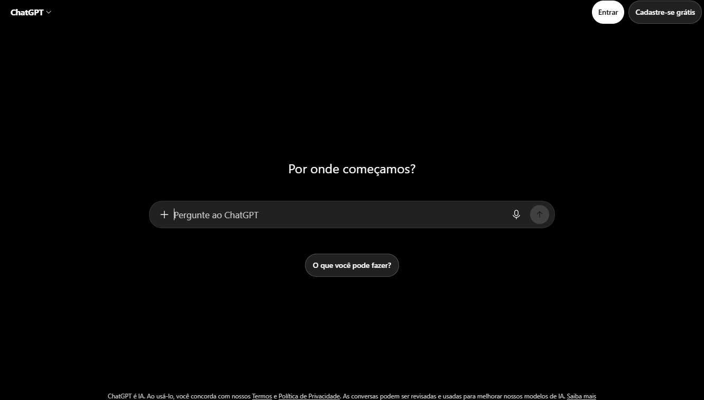
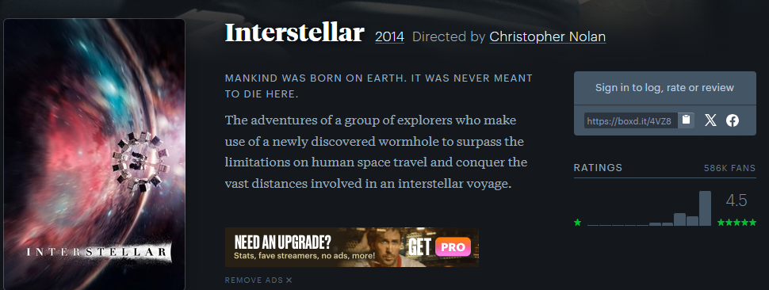
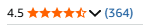

# References — Tux TV

## 1. Objetivo

As referências abaixo orientam as decisões de experiência e interface do Tux TV, aplicação de busca de filmes com dados da TMDB.

## 2. Referência 01 — Letterboxd

### Fonte
Letterboxd (letterboxd.com)

### Imagem

### O que observamos?
O card de detalhes de filme: pôster em destaque ao lado das informações textuais (título, sinopse), com um card de fundo contrastante sobre o fundo escuro da página, agrupando visualmente todas as informações do filme.

### O que vamos aproveitar?
A estrutura de layout — pôster à esquerda, informações à direita, dentro de um card único com fundo levemente mais claro que o restante da página — e a estética escura geral da interface.

### Como será adaptado?
No Tux TV, esse padrão vira o componente `MovieCard`, usado na página de Detalhes: pôster à esquerda, e à direita título, avaliação em estrelas, sinopse e os logos dos serviços de streaming onde o filme está disponível — uma informação que o Letterboxd não exibe, mas que é o diferencial da nossa aplicação.

## 3. Referência 02 — ChatGPT

### Fonte
ChatGPT (chatgpt.com)

### Imagem

### O que observamos?
A tela inicial: uma pergunta curta e convidativa acima de uma barra de busca em formato de pílula, centralizada vertical e horizontalmente, com fundo preto e a barra em um tom de cinza escuro que contrasta sutilmente.

### O que vamos aproveitar?
O estilo visual da barra de busca (formato de pílula, botão circular de ação à direita) e a ideia de um texto curto de convite acima dela, centralizando toda a composição na tela.

### Como será adaptado?
Vira a página Home do Tux TV: o texto "Qual filme você está procurando?" acima da barra de busca, ambos centralizados na tela, com a mesma paleta escura (fundo preto, barra em cinza `#2a2a2a`). A mesma barra reaparece, em versão compacta, no topo das páginas de Detalhes e Não Encontrado.

## 4. Referência 03 — Amazon

### Fonte
Amazon (amazon.com.br)

### Imagem

### O que observamos?
O padrão de avaliação em estrelas usado nas páginas de produto: cinco estrelas, preenchidas proporcionalmente à nota, com leitura visual instantânea da qualidade/avaliação sem precisar interpretar um número.

### O que vamos aproveitar?
A ideia de converter uma nota numérica em um indicador visual de estrelas, mais rápido de interpretar do que um número isolado.

### Como será adaptado?
A nota do filme na TMDB (`vote_average`, escala de 0 a 10) é convertida para uma escala de 0 a 5 estrelas e exibida no `MovieCard`, com as estrelas preenchidas em dourado até o valor correspondente, seguindo o mesmo princípio de leitura rápida usado pela Amazon.